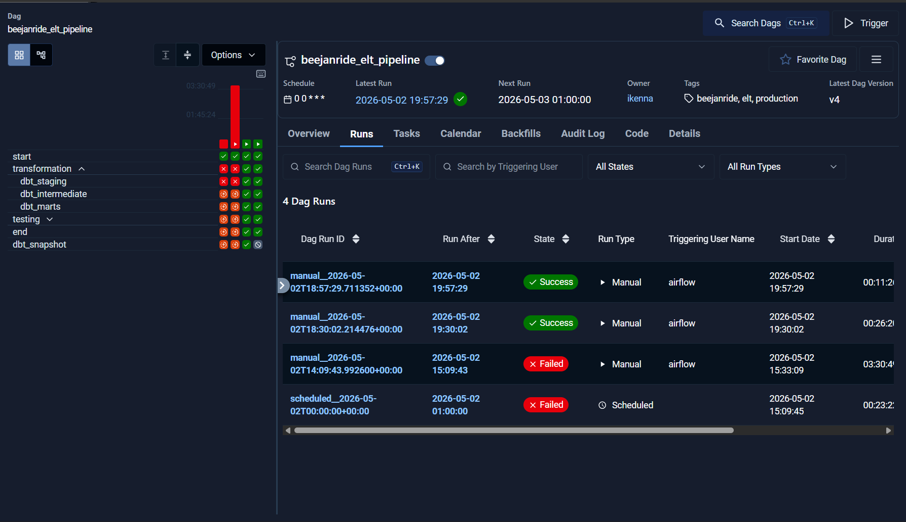
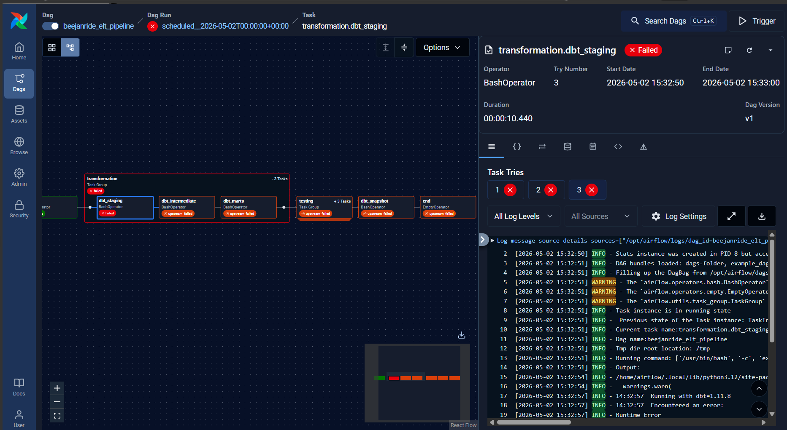
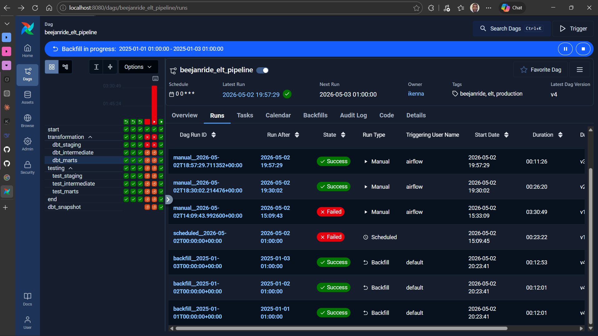

# BeejanRide Airflow Orchestration

Production-grade ELT orchestration for the **BeejanRide analytics platform** using **Apache Airflow 3.1.8**.

---

## Table of Contents

- [Architecture Overview](#architecture-overview)
- [Technology Stack](#technology-stack)
- [Project Structure](#project-structure)
- [Airflow Setup](#airflow-setup)
- [DAG Design](#dag-design)
- [Idempotency](#idempotency)
- [Failure Handling](#failure-handling)
- [Backfill](#backfill)
- [Scheduling](#scheduling)
- [Running the Pipeline](#running-the-pipeline)
- [Screenshots](#screenshots)
- [License](#license)

---

## Architecture Overview

This project orchestrates a full ELT pipeline for BeejanRide analytics.

### Data Flow

- PostgreSQL (Supabase)
- Airbyte OSS (Incremental Sync) *(orchestrated by Airflow, currently commented out)*
- BigQuery Raw Layer (`BeejanRide_raw_dataset`)
- dbt Staging Layer (`dbt_BeejanRide_staging`)
- dbt Intermediate Layer (`dbt_BeejanRide_int_*`)
- dbt Marts Layer (`dbt_BeejanRide_marts`)
- dbt Tests
- Dashboards & Analytics

---

## Technology Stack

| Component | Tool |
|----------|------|
| Orchestration | Apache Airflow 3.1.8 |
| Ingestion | Airbyte OSS |
| Warehouse | Google BigQuery |
| Transformation | dbt Core 1.11.8 |
| Deployment | Docker Compose (WSL Ubuntu) |
| Executor | CeleryExecutor |
| Broker | Redis 7.2 |
| Metadata DB | PostgreSQL 16 |

---

## Project Structure

```bash
beejanride-airflow/
├── dags/
│   └── BeejanRide_project/
│       ├── __init__.py
│       ├── beejanride_elt_pipeline.py          # Main DAG file
│       └── include/
│           ├── __init__.py
│           ├── dbt_commands.py                 # Reusable dbt command builder
│           └── airbyte_connections.py          # Airbyte connection IDs via Airflow Variables
│
├── screenshots/
│   ├── successful_dag_run.png
│   ├── failed_dag_run.png
│   └── backfill_execution.png
│
├── Dockerfile                                  # Custom Airflow image with dbt-bigquery pre-installed
├── docker-compose.yaml                          # Full Airflow stack definition
├── .gitignore
└── README.md
```

---

## Airflow Setup

### Custom Docker Image

Rather than installing dependencies at container startup (slow and fragile), dbt and the Airbyte provider are baked into a custom image built from the Dockerfile:

```dockerfile
FROM apache/airflow:3.1.8

USER airflow

RUN pip install --no-cache-dir \
    apache-airflow-providers-airbyte==5.4.1 \
    apache-airflow-providers-http \
    dbt-bigquery
```

---

### Volume Mounts

The following paths are mounted into all Airflow containers:

| Host Path | Container Path | Purpose |
|----------|----------------|---------|
| `~/airflow/dags` | `/opt/airflow/dags` | DAG files |
| `~/airflow/logs` | `/opt/airflow/logs` | Task logs |
| `~/projects/BeejanRide_project` | `/opt/airflow/dbt_project` | dbt project files |
| `~/.dbt/keys/beejanride-project.json` | `/opt/airflow/gcp_keyfile.json` | GCP service account key (read-only) |
| `~/.dbt/profiles.yml` | `/opt/airflow/dbt_profiles/profiles.yml` | dbt profiles (read-only) |

---

### Airflow Connections

Set in **Airflow UI → Admin → Connections**:

| Connection ID | Type | Host | Port | Purpose |
|--------------|------|------|------|---------|
| `airbyte_default` | HTTP | `host.docker.internal` | `8000` | Airbyte API |

---

### Airflow Variables

Set in **Airflow UI → Admin → Variables**:

| Variable Key | Value | Purpose |
|-------------|-------|---------|
| `airbyte_conn_trips` | `<uuid>` | Airbyte connection ID for trips table |
| `airbyte_conn_drivers` | `<uuid>` | Airbyte connection ID for drivers table |
| `airbyte_conn_riders` | `<uuid>` | Airbyte connection ID for riders table |
| `airbyte_conn_payments` | `<uuid>` | Airbyte connection ID for payments table |
| `airbyte_conn_cities` | `<uuid>` | Airbyte connection ID for cities table |
| `airbyte_conn_driver_status_events` | `<uuid>` | Airbyte connection ID for driver status events table |

---

## DAG Design

**DAG ID:** `beejanride_elt_pipeline`  
**Schedule:** `@daily`  
**Owner:** `ikenna`  
**Tags:** `beejanride`, `elt`, `production`

---

### Task Groups & Dependencies

```text
start
  |
  └── ingestion (commented out)
        ├── sync_trips
        ├── sync_drivers
        ├── sync_riders
        ├── sync_payments
        ├── sync_cities
        └── sync_driver_status_events
              |
              v
  └── transformation
        ├── dbt_staging
        ├── dbt_intermediate
        └── dbt_marts
              |
              v
  └── testing
        ├── test_staging
        ├── test_intermediate
        └── test_marts
              |
              v
end
```

---

### Key Design Decisions

#### 1. TaskGroups for separation of concerns
Tasks are grouped into `ingestion`, `transformation`, and `testing`. Each group has one responsibility, making failures easier to locate and debug.

#### 2. Layer-by-layer execution
dbt models run in strict order:

`staging → intermediate → marts`

Tests run immediately after each layer to stop bad data early.

#### 3. Retries with exponential backoff
Every task retries twice with exponential backoff:

`5min → 10min → 20min`

This handles transient BigQuery and network failures.

#### 4. `max_active_runs=1`
Only one pipeline run can execute at a time. This prevents concurrent writes to the same BigQuery tables.

#### 5. `--full-refresh` on all dbt run tasks
All dbt transformation tasks use `--full-refresh` because BigQuery free tier does not support the DML `MERGE` statements that incremental models require.

With billing enabled, remove `full_refresh=True` from `dbt_commands.py` calls and incremental models will process only new rows per run.

#### 6. Airbyte connection IDs as Airflow Variables
Airbyte connection UUIDs are never hardcoded in the DAG. They are stored in Airflow Variables and retrieved at runtime via `Variable.get()`.

Updating a connection ID requires no code changes, only a variable update in the UI.

#### 7. dbt profiles separated from project directory
`profiles.yml` is mounted to a dedicated path (`/opt/airflow/dbt_profiles/`) separate from the dbt project directory. This avoids Docker volume mount conflicts.

---

## Idempotency

Running the pipeline multiple times produces the same result:

| Mechanism | How it ensures idempotency |
|----------|-----------------------------|
| `dbt --full-refresh` | Drops and rebuilds tables every run |
| `unique_key` on incremental models | Prevents duplicate rows |
| `max_active_runs=1` | No overlapping DAG runs |
| Explicit backfills | Backfills only happen intentionally |

---

## Failure Handling

| Scenario | Behaviour |
|---------|-----------|
| dbt model fails | Task retries 2x with exponential backoff then marks failed |
| Downstream tasks | Marked `upstream_failed` automatically |
| Airbyte sync fails | Transformation tasks blocked until ingestion succeeds |
| Full pipeline failure | Previous successful mart tables remain intact in BigQuery |

---

## Backfill

Backfills are triggered explicitly using the Airflow CLI:

```bash
docker exec airflow-airflow-scheduler-1 airflow backfill create \
  --dag-id beejanride_elt_pipeline \
  --from-date YYYY-MM-DD \
  --to-date YYYY-MM-DD
```

`catchup=False` is set in the DAG.  
This prevents Airflow from automatically backfilling missed scheduled runs.

Backfills must always be triggered explicitly, preventing accidental large runs that may consume BigQuery quota unexpectedly.

---

## Scheduling

The DAG runs on a `@daily` schedule.

To pause the schedule:

```bash
docker exec airflow-airflow-scheduler-1 airflow dags pause beejanride_elt_pipeline
```

To resume:

```bash
docker exec airflow-airflow-scheduler-1 airflow dags unpause beejanride_elt_pipeline
```

---

## Running the Pipeline

### Start Airflow

```bash
cd ~/airflow
docker compose up -d
```

Access the UI at:  
`http://localhost:8080`

Default credentials:  
`airflow / airflow`

---

### Build the custom image (first time or after Dockerfile changes)

```bash
docker compose build
docker compose up -d
```

---

### Trigger a manual run

```bash
docker exec airflow-airflow-scheduler-1 airflow dags trigger beejanride_elt_pipeline
```

Or click **Trigger DAG** in the Airflow UI.

---

### Trigger a backfill

```bash
docker exec airflow-airflow-scheduler-1 airflow backfill create \
  --dag-id beejanride_elt_pipeline \
  --from-date 2025-01-01 \
  --to-date 2025-01-03
```

---

## Screenshots

### Successful DAG Run


### Failed DAG Run


### Backfill Execution


---

## License

This project is for educational and portfolio purposes.
